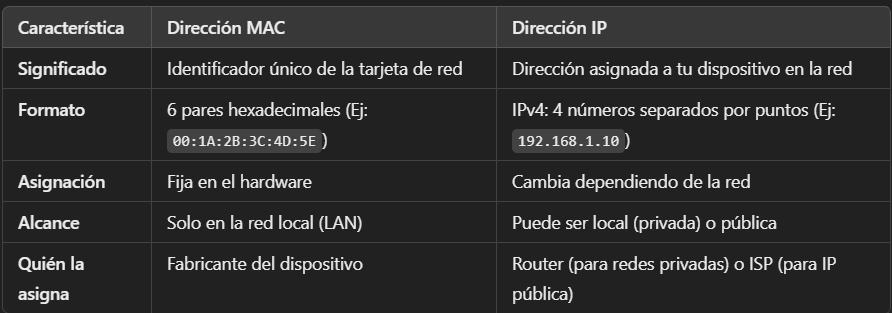

# Seguridad de Red WiFi

## Descripción
Este es un pequeño script en Python que permite verificar los dispositivos conectados a la red WiFi, acceder al panel del router para cambiar la contraseña y brindar instrucciones sobre cómo bloquear dispositivos no deseados.

## Características de IP y MAC:



## Características
- Lista los dispositivos conectados a la red usando el comando `arp -a`.
- Abre el panel de administración del router en el navegador predeterminado.
- Indica cómo bloquear dispositivos sospechosos mediante el panel del router.

## Requisitos
- Python 3.x instalado en el sistema.
- Sistema operativo Windows.
- Acceso a la red WiFi y al panel del router.

## Instalación y Uso
1. **Clonar o descargar** este repositorio.
2. **Ejecutar el script** en la terminal o CMD de Windows:
   ```sh
   python protected.py
   ```
3. **Seguir las instrucciones** en pantalla:
   - Se mostrarán los dispositivos conectados.
   - Se ofrecerá la opción de cambiar la contraseña del WiFi.
   - Se brindará la opción de bloquear dispositivos no deseados.

## Explicación de Funciones
### `get_connected_devices()`
Ejecuta el comando `arp -a` para obtener una lista de los dispositivos conectados a la red junto con sus direcciones IP y MAC.

### `open_router_panel()`
Abre el navegador web en la dirección `http://192.168.1.1`, que es la dirección por defecto del panel de administración de la mayoría de los routers.

### `block_devices(mac_address)`
Indica al usuario cómo bloquear manualmente un dispositivo específico accediendo al panel del router.

### `secure_wifi()`
Ejecuta la secuencia completa de seguridad:
1. Lista los dispositivos conectados.
2. Ofrece la opción de cambiar la contraseña WiFi.
3. Da la opción de bloquear dispositivos sospechosos.

## Notas
- Este script está diseñado para Windows, ya que usa `arp -a`, un comando específico del sistema.
- Para bloquear dispositivos es necesario hacerlo manualmente desde la configuración del router.
- Se recomienda actualizar la configuración de seguridad del router regularmente.

## Contribución
Si deseas mejorar el código o agregar nuevas funciones, ¡siéntete libre de hacer un fork y enviar un pull request!

## Licencia
Este proyecto se distribuye bajo la licencia MIT.

## Contacto
Si tienes dudas o sugerencias, puedes contactarnos en:

Correo: arielaparicio100@gmail.com


